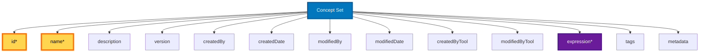
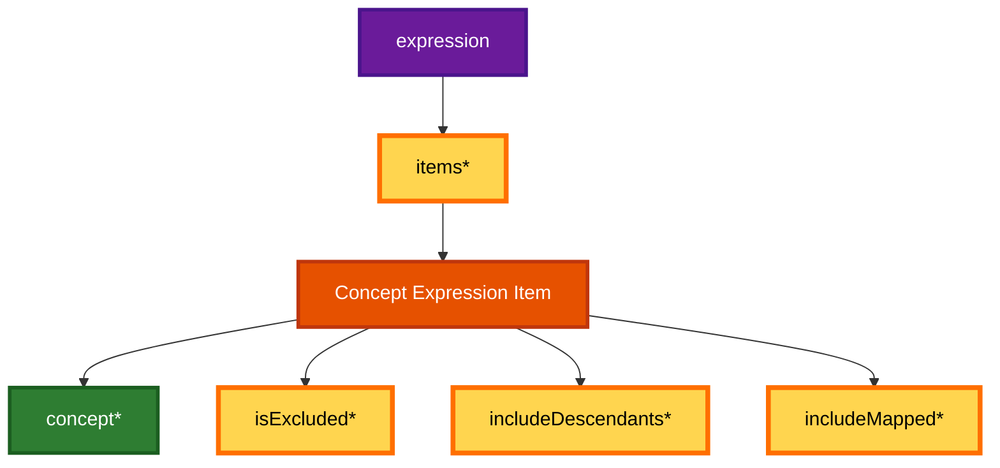
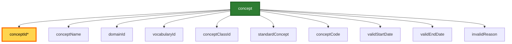

# Concept Set Specification (DRAFT)

A **Concept Set** is a JSON structure used in the **OHDSI** (Observational Health Data Sciences and Informatics) community to define and manage a standardized collection of medical concepts. Concept Sets are typically used to specify collections of standardized vocabulary concepts for use in observational research, cohort definitions, and analytics, enabling consistent identification of clinical phenomena across different healthcare databases.

## Schema Overview

The Concept Set schema has a hierarchical structure with three main levels. The diagrams below illustrate each level separately for clarity.

### 1. Concept Set Root Structure

The top-level Concept Set object contains metadata, provenance information, and an expression that defines which concepts are included:



### 2. Expression Structure

The `expression` object contains an array of concept expression items that define inclusion/exclusion rules:



### 3. Concept Object Details

Each `concept` references an OMOP vocabulary concept. Only `conceptId` is required; all other fields are optional and can be resolved from the vocabulary:



**Legend:**
- **Yellow background with orange border**: Required fields (marked with *)
- **Gray border**: Optional fields
- **Blue nodes**: Root Concept Set object
- **Purple nodes**: Expression container
- **Orange nodes**: Concept Expression Item
- **Green nodes**: Individual Concept details

## JSON Structure

### Root Level Properties

- **id** (integer, required): A unique identifier for the concept set within a given system.
- **name** (string, required): The name of the concept set, providing a human-readable description that should be meaningful to clinical researchers.
- **description** (string, optional): A detailed explanation of the concept set's purpose, inclusion criteria, and clinical rationale.
- **version** (string, optional): Semantic version string (major.minor.patch format) for tracking concept set evolution over time.
- **createdBy** (string, optional): Username or identifier of the person who created the concept set for provenance tracking.
- **createdDate** (string, optional): ISO 8601 timestamp of concept set creation.
- **modifiedBy** (string, optional): Username or identifier of the last person to modify the concept set.
- **modifiedDate** (string, optional): ISO 8601 timestamp of the last modification.
- **createdByTool** (string, optional): Name and version of the tool/software used to create the concept set (e.g., "ATLAS 2.12.0", "CAPR 4.3", "Custom Script v1.0"). This field tracks what tool was used, while `createdBy` tracks who used it.
- **modifiedByTool** (string, optional): Name and version of the tool/software used for the last modification (e.g., "ATLAS 2.12.0", "CAPR 4.3").
- **expression** (object, required): The logical definition of which concepts are included in the set.
- **tags** (array, optional): Optional array of string tags for categorization and searchability.
- **metadata** (object, optional): Extensible object for additional implementation-specific data.

### Expression Structure

The **expression** object contains:
- **items** (array, required): A list of concept expression items, where each item includes:
    - **concept** (object, required): The concept reference from OMOP vocabulary, including:
        - **conceptId** (integer, required): The unique OMOP concept identifier.
        - **conceptName** (string, optional): The human-readable name of the concept. Can be resolved from vocabulary.
        - **domainId** (string, optional): The OMOP domain to which the concept belongs (e.g., Condition, Drug, Procedure). Can be resolved from vocabulary.
        - **vocabularyId** (string, optional): The source vocabulary system (e.g., SNOMED, ICD10CM, RxNorm). Can be resolved from vocabulary.
        - **conceptClassId** (string, optional): The classification of the concept within its vocabulary. Can be resolved from vocabulary.
        - **standardConcept** (string or null, optional): Standard concept designation ("S" for Standard, "C" for Classification, null for non-standard). Can be resolved from vocabulary.
        - **conceptCode** (string, optional): The original code from the source vocabulary. Can be resolved from vocabulary.
        - **validStartDate** (string, optional): Date when the concept became valid (YYYY-MM-DD format). Can be resolved from vocabulary.
        - **validEndDate** (string, optional): Date when the concept becomes invalid (YYYY-MM-DD format). Can be resolved from vocabulary.
        - **invalidReason** (string or null, optional): Reason for concept invalidation ("D" for deleted, "U" for updated, null for valid concepts). Can be resolved from vocabulary.
    - **isExcluded** (boolean, required): Indicates whether the concept should be excluded from the set (false = include, true = exclude).
    - **includeDescendants** (boolean, required): Specifies whether descendant concepts in the vocabulary hierarchy should be included.
    - **includeMapped** (boolean, required): Specifies whether concepts mapped from source vocabularies should be included.

## Usage

Concept Sets are fundamental building blocks in OHDSI research, used in:
- **Cohort definitions**: Defining inclusion and exclusion criteria for study populations
- **Feature extraction**: Identifying relevant clinical events, medications, or procedures
- **Outcome definitions**: Specifying endpoints for observational studies
- **Phenotype algorithms**: Creating reproducible definitions of clinical conditions
- **Multi-database studies**: Ensuring consistent concept identification across different OHDSI network partners

The hierarchical inclusion/exclusion logic allows for sophisticated concept set definitions that can capture clinical nuance while maintaining computational precision.

## Design Philosophy

### Minimal Required Fields Approach

This specification adopts a **minimal required fields** design philosophy for concept metadata. Within the concept object, only `conceptId` is required, while all other fields (conceptName, domainId, vocabularyId, etc.) are optional.

### Rationale

1. **Separation of Concerns**: The concept set specification defines *which concepts* to include/exclude and *how* to expand them (via descendants and mappings). The OMOP vocabulary defines *what those concepts are*. This separation prevents redundant data storage.

2. **Vocabulary Independence**: By not requiring vocabulary metadata, concept sets remain valid across vocabulary version updates. Concept names, domains, or other attributes may change over time, but the conceptId remains stable.

3. **Efficiency at Scale**: Large concept sets with hundreds or thousands of concepts benefit significantly from reduced file sizes when only storing concept IDs rather than full metadata.

4. **Flexible Implementation**: Systems with vocabulary access can look up concept details on demand, while systems without can still process the core inclusion/exclusion logic if they have pre-resolved concept lists.

### When to Include Optional Metadata

While optional, including full concept metadata is valuable in these scenarios:

- **Human Readability**: Documentation, review processes, or presentations benefit from having concept names readily visible
- **Offline Usage**: When the concept set will be used in environments without vocabulary database access
- **Provenance Tracking**: Capturing a snapshot of concept metadata at the time of concept set creation
- **Interoperability**: Exchanging data with systems that may not have OMOP vocabulary access
- **Self-Documenting Artifacts**: Research publications or regulatory submissions where concept sets should be fully self-contained

### Implementation Considerations

**For Tool Developers:**
- Tools MUST support concept sets with only conceptId specified
- Tools MAY include full metadata when creating concept sets for convenience
- Tools SHOULD validate conceptIds against vocabulary when available
- Tools SHOULD handle both minimal and fully-populated formats gracefully

**For Concept Set Authors:**
- Use minimal format for programmatic generation and large-scale concept sets
- Use full metadata format for human-reviewed or published concept sets
- Consider your audience's likely vocabulary access when choosing format

## JSON Schema

The following JSON Schema defines the complete structure of the Concept Set object and is available for programmatic access at:

**GitHub URL:** `https://raw.githubusercontent.com/ohdsi/tab/main/docs/schemas/concept-set-schema.json`

This schema can be used for validation, code generation, and tool development. The schema is maintained as a single source of truth and automatically included in this documentation.

<<< @/schemas/concept-set-schema.json{json}

## Example Concept Set

### Simple Concept Set
```json
{
  "id": 123,
  "name": "Type 2 Diabetes Mellitus",
  "description": "Concept set for identifying Type 2 diabetes mellitus cases in observational studies",
  "version": "1.0.0",
  "createdBy": "researcher@example.org",
  "createdDate": "2024-01-15T10:30:00Z",
  "createdByTool": "ATLAS 2.12.0",
  "expression": {
    "items": [
      {
        "concept": {
          "conceptId": 201826,
          "conceptName": "Type 2 diabetes mellitus",
          "domainId": "Condition",
          "vocabularyId": "SNOMED",
          "conceptClassId": "Clinical Finding",
          "standardConcept": "S",
          "conceptCode": "44054006",
          "validStartDate": "1970-01-01",
          "validEndDate": "2099-12-31",
          "invalidReason": null
        },
        "isExcluded": false,
        "includeDescendants": true,
        "includeMapped": true
      }
    ]
  },
  "tags": ["diabetes", "endocrine", "chronic-disease"]
}
```

### Complex Concept Set with Exclusions
```json
{
  "id": 456,
  "name": "Heart Failure excluding Rheumatic",
  "description": "Heart failure concept set excluding rheumatic heart failure cases",
  "version": "1.2.0",
  "expression": {
    "items": [
      {
        "concept": {
          "conceptId": 316139,
          "conceptName": "Heart failure",
          "domainId": "Condition",
          "vocabularyId": "SNOMED",
          "conceptClassId": "Clinical Finding",
          "standardConcept": "S",
          "conceptCode": "84114007",
          "validStartDate": "2002-01-30",
          "validEndDate": "2099-12-30",
          "invalidReason": null
        },
        "isExcluded": false,
        "includeDescendants": true,
        "includeMapped": false
      },
      {
        "concept": {
          "conceptId": 315295,
          "conceptName": "Congestive rheumatic heart failure",
          "domainId": "Condition",
          "vocabularyId": "SNOMED",
          "conceptClassId": "Clinical Finding",
          "standardConcept": "S",
          "conceptCode": "82523003",
          "validStartDate": "2002-01-30",
          "validEndDate": "2099-12-30",
          "invalidReason": null
        },
        "isExcluded": true,
        "includeDescendants": true,
        "includeMapped": false
      }
    ]
  },
  "tags": ["cardiology", "heart-failure"]
}
```

### Minimal Concept Set (ID-only format)
```json
{
  "id": 789,
  "name": "Essential Hypertension",
  "description": "Minimal concept set using only concept IDs for efficient storage",
  "version": "1.0.0",
  "createdByTool": "CAPR 4.3",
  "expression": {
    "items": [
      {
        "concept": {
          "conceptId": 320128
        },
        "isExcluded": false,
        "includeDescendants": true,
        "includeMapped": true
      },
      {
        "concept": {
          "conceptId": 437663
        },
        "isExcluded": false,
        "includeDescendants": true,
        "includeMapped": false
      }
    ]
  },
  "tags": ["hypertension", "cardiovascular"]
}
```

**Note**: The minimal format is valid and efficient for systems with vocabulary access. Tools can look up concept IDs 320128 (Essential hypertension) and 437663 (Hypertensive disorder) to retrieve full concept details as needed.

## Implementation Notes

1. **Minimal Required Fields**: Only the `conceptId` field is required within the concept object. All other concept details (name, domain, vocabulary, etc.) are optional and can be resolved by looking up the concept ID in any OMOP vocabulary instance. This design:
   - Reduces file sizes for concept sets with many concepts
   - Avoids redundant storage of vocabulary metadata
   - Makes concept sets independent of vocabulary version updates
   - Allows tools to enrich concept data as needed based on available vocabulary access

2. **When to Include Full Concept Metadata**: While optional, including full concept details is recommended when:
   - Human readability is important (e.g., for documentation or review)
   - The concept set will be used offline or without vocabulary access
   - You want to capture a snapshot of concept metadata at creation time
   - Exchanging data with systems that may not have vocabulary access

3. **Validation**: Implementations should validate concept IDs against the current OMOP vocabulary to ensure data quality.

4. **Hierarchical Logic**: When `includeDescendants` is true, all child concepts in the vocabulary hierarchy are automatically included, enabling comprehensive phenotype capture.

5. **Exclusion Processing**: Excluded concepts are processed after inclusions, effectively removing concepts that would otherwise be included through hierarchical or mapping rules.

6. **Temporal Considerations**: The `validStartDate` and `validEndDate` fields (when included) allow implementations to consider concept validity periods for historical data analysis.

7. **Versioning**: Concept sets should use semantic versioning to track evolution over time, particularly important for longitudinal studies and reproducible research.

8. **Extensibility**: The `metadata` field allows for implementation-specific extensions while maintaining core compatibility across OHDSI tools.

9. **Provenance**: Provenance tracking is supported through two complementary sets of fields:
   - **Person tracking**: `createdBy` and `modifiedBy` capture who created or modified the concept set (username, email, or identifier)
   - **Tool tracking**: `createdByTool` and `modifiedByTool` capture what software was used (e.g., "ATLAS 2.12.0", "CAPR 4.3", "Custom Script v1.0")
   - Both are optional and backward compatible with existing ATLAS/WebAPI implementations
   - Together, these fields enable comprehensive tracking of concept set authorship, tool usage, and change history, crucial for research transparency, reproducibility, and collaboration